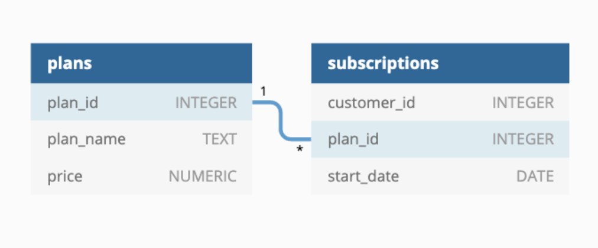
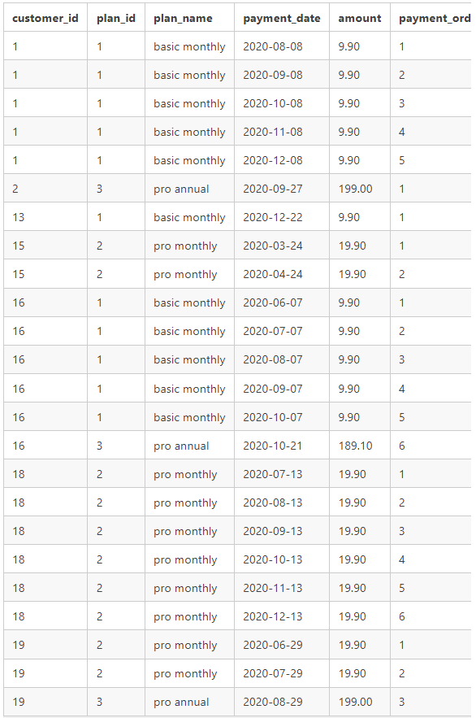

# Case Study #3 - Foodie-Fi

## Entity Relationship Diagram (ERD)

## Schema
You can access the schema's file [here](schema).

## Case Study Questions

### A. Customer Journey
Based off the 8 sample customers provided in the sample from the subscriptions table, write a brief description about each customer’s onboarding journey.

Try to keep it as short as possible - you may also want to run some sort of join to make your explanations a bit easier!

You can find my PostgreSQL script [here](Aweek03).

### B. Data Analysis Questions
1.	How many customers has Foodie-Fi ever had?
2.	What is the monthly distribution of trial plan start_date values for our dataset - use the start of the month as the group by value
3.	What plan start_date values occur after the year 2020 for our dataset? Show the breakdown by count of events for each plan_name
4.	What is the customer count and percentage of customers who have churned rounded to 1 decimal place?
5.	How many customers have churned straight after their initial free trial - what percentage is this rounded to the nearest whole number?
6.	What is the number and percentage of customer plans after their initial free trial?
7.	What is the customer count and percentage breakdown of all 5 plan_name values at 2020-12-31?
8.	How many customers have upgraded to an annual plan in 2020?
9.	How many days on average does it take for a customer to an annual plan from the day they join Foodie-Fi?
10.	Can you further breakdown this average value into 30 day periods (i.e. 0-30 days, 31-60 days etc)
11.	How many customers downgraded from a pro monthly to a basic monthly plan in 2020?

### C. Challenge Payment Question
The Foodie-Fi team wants you to create a new payments table for the year 2020 that includes amounts paid by each customer in the subscriptions table with the following requirements:
● monthly payments always occur on the same day of month as the original start_date of any monthly paid plan
● upgrades from basic to monthly or pro plans are reduced by the current paid amount in that month and start immediately
● upgrades from pro monthly to pro annual are paid at the end of the current billing period and also starts at the end of the month period
● once a customer churns they will no longer make payments

Example outputs for this table might look like the following:

### D. Outside The Box Questions
The following are open ended questions which might be asked during a technical interview for this case study - there are no right or wrong answers, but answers that make sense from both a technical and a business perspective make an amazing impression!

1.	How would you calculate the rate of growth for Foodie-Fi?
2.	What key metrics would you recommend Foodie-Fi management to track over time to assess performance of their overall business?
3.	What are some key customer journeys or experiences that you would analyse further to improve customer retention?
4.	If the Foodie-Fi team were to create an exit survey shown to customers who wish to cancel their subscription, what questions would you include in the survey?
5.	What business levers could the Foodie-Fi team use to reduce the customer churn rate? How would you validate the effectiveness of your ideas?